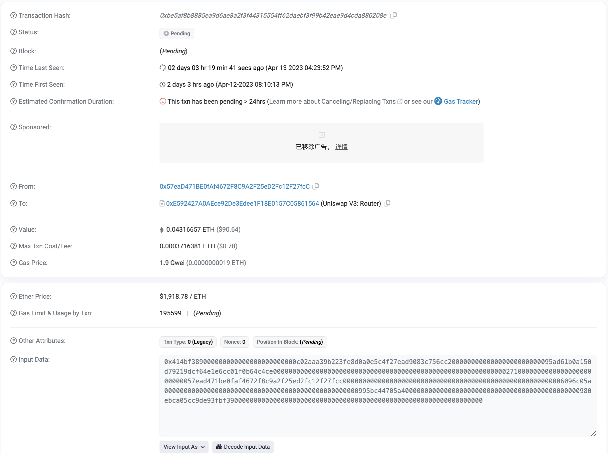
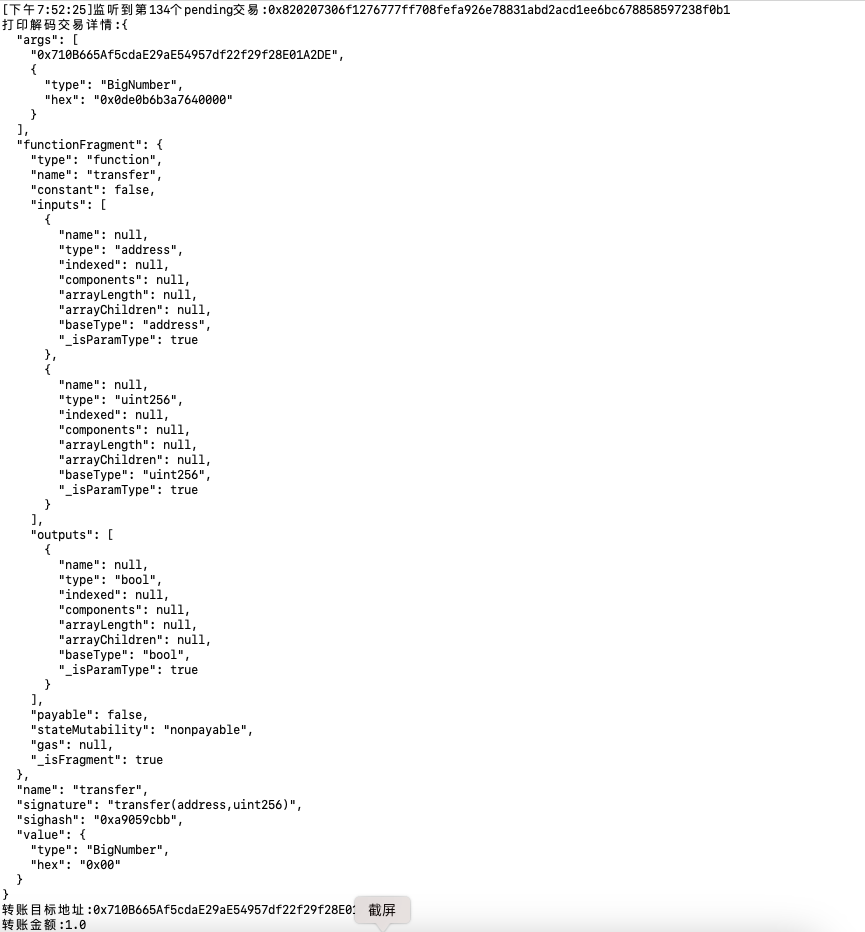

# Ethers极简入门: 20. 解码交易详情

我最近在重新学`ethers.js`，巩固一下细节，也写一个`WTF Ethers极简入门`，供小白们使用。

**推特**：[@0xAA_Science](https://twitter.com/0xAA_Science)

**WTF Academy社群：** [官网 wtf.academy](https://wtf.academy) | [WTF Solidity教程](https://github.com/AmazingAng/WTF-Solidity) | [discord](https://discord.gg/5akcruXrsk) | [微信群申请](https://docs.google.com/forms/d/e/1FAIpQLSe4KGT8Sh6sJ7hedQRuIYirOoZK_85miz3dw7vA1-YjodgJ-A/viewform?usp=sf_link)

所有代码和教程开源在github: [github.com/WTFAcademy/WTFEthers](https://github.com/WTFAcademy/WTF-Ethers)

-----

这一讲，我们以未决交易（Pending Transaction）为例，介绍如何解码交易详情。

## 未决交易

未决交易是用户发出但没被矿工打包上链的交易，在mempool（交易内存池）中出现。对于`mempool`的更多介绍可以看[WTF Ethers极简教程第19讲：监听Mempool](https://github.com/WTFAcademy/WTF-Ethers/blob/main/19_Mempool/readme.md)

下面是一个转账`ERC20`代币的未决交易，你可以在[etherscan](https://etherscan.io/tx/0xbe5af8b8885ea9d6ae8a2f3f44315554ff62daebf3f99b42eae9d4cda880208e)上查看交易详情：



红框中是这个交易的`input data`，看似杂乱无章的十六进制数据，实际上编码了这笔交易的内容：包括调用的函数，以及输入的参数。我们在etherscan点击**Decode Input Data**按钮，就可以解码这段数据：


解码之后，我们可以看到这笔交易调用的函数以及输入的参数。

## Interface类

`ethers.js`提供了`Interface`类方便解码交易数据。声明`Interface`类型和声明`abi`的方法差不多，例如：

```js
const iface = ethers.Interface([
    "function balanceOf(address) public view returns(uint)",
    "function transfer(address, uint) public returns (bool)",
    "function approve(address, uint256) public returns (bool)"
]);
```

## 解码交易数据

下面我们写一个解码未决交易数据的脚本。

1. 创建`provider`和`wallet`，监听交易时候推荐用`wss`连接而不是`http`。

    ```js
    // 准备 alchemy API 可以参考https://github.com/AmazingAng/WTF-Solidity/blob/main/Topics/Tools/TOOL04_Alchemy/readme.md 
    const ALCHEMY_MAINNET_WSSURL = 'wss://eth-mainnet.g.alchemy.com/v2/oKmOQKbneVkxgHZfibs-iFhIlIAl6HDN';
    const provider = new ethers.WebSocketProvider(ALCHEMY_MAINNET_WSSURL);
    let network = provider.getNetwork()
    network.then(res => console.log(`[${(new Date).toLocaleTimeString()}] 连接到 chain ID ${res.chainId}`));
    ```

2. 创建`Interface`对象，用于解码交易详情。

    ```js
    const iface = new ethers.Interface([
    "function transfer(address, uint) public returns (bool)",
    ])
    ```

3. 获取函数选择器。

    ```js
    const functionSignature = 'transfer(address,uint)'
    const selector = iface.getSighash(functionSignature)
    console.log(`函数选择器是${selector}`)
    ```

4. 监听`pending`的`ERC20` 转账交易，获取交易详情并解码：

    ```js
    rovider.on('pending', async (txHash) => {
    if (txHash) {
        const tx = await provider.getTransaction(txHash)
        j++
        if (tx !== null && tx.data.indexOf(selector) !== -1) {
            console.log(`[${(new Date).toLocaleTimeString()}]监听到第${j + 1}个pending交易:${txHash}`)
            console.log(`打印解码交易详情:${JSON.stringify(iface.parseTransaction(tx), null, 2)}`)
            console.log(`转账目标地址:${iface.parseTransaction(tx).args[0]}`)
            console.log(`转账金额:${ethers.utils.formatEther(iface.parseTransaction(tx).args[1])}`)
            provider.removeListener('pending', this)
        }
    }})
    ```

    

5. 交易参数解码：

    

## 总结

这一讲，我们介绍了`ethers.js`的`Interface`类，并利用它解码了`mempool`中的`Uniswap`交易。
