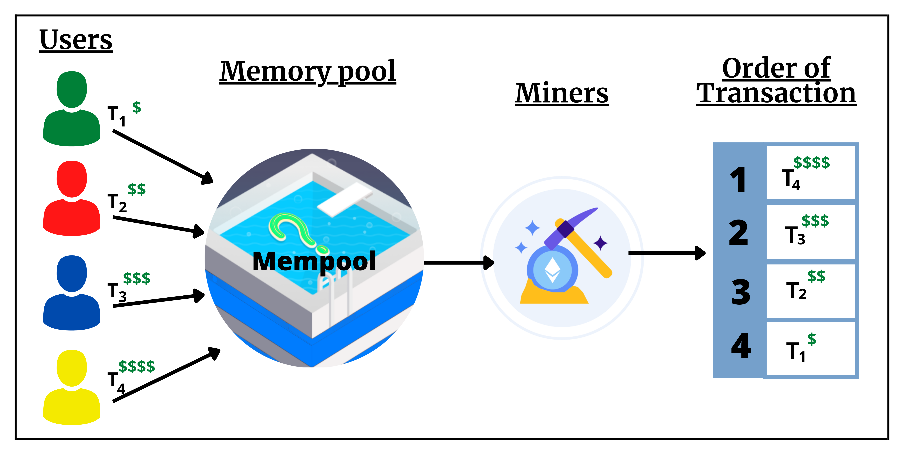

# WTF Ethers: 19. Listening to Mempool

I have recently been revisiting `ethers.js` to reinforce my understanding of the details and also to create a simplified guide called `# WTF Ethers` for beginners.

**Twitter**: [@0xAA_Science](https://twitter.com/0xAA_Science)

**WTF Academy Community**: [Official Website wtf.academy](https://wtf.academy) | [WTF Solidity Tutorial](https://github.com/AmazingAng/WTF-Solidity) | [discord](https://discord.gg/5akcruXrsk) | [WeChat Group Application](https://docs.google.com/forms/d/e/1FAIpQLSe4KGT8Sh6sJ7hedQRuIYirOoZK_85miz3dw7vA1-YjodgJ-A/viewform?usp=sf_link)

All codes and tutorials are open-source on GitHub: [github.com/WTFAcademy/WTF-Ethers](https://github.com/WTFAcademy/WTF-Ethers)

-----

In this lesson, we will learn how to read transactions from the `mempool`.

## MEV

`MEV` (Maximal Extractable Value) is a fascinating topic. Most people are unfamiliar with it as it did not exist before the invention of blockchain that supports smart contracts. It's a feast for scientists, a friend of miners, and a nightmare for retail investors.

In blockchain, miners can profit by packing, excluding, or reordering transactions in the blocks they generate, and `MEV` is a metric that measures this profit.

## Mempool

Before a user's transaction is included in the Ethereum blockchain by miners, all transactions gather in the Mempool. Miners also search for high fee transactions in the Mempool to prioritize packaging and maximize their profits. Generally, transactions with higher gas prices are more likely to be packaged.

At the same time, some `MEV` bots also search for profitable trades in the `mempool`. For example, a `swap` transaction with a high slippage setting may be subject to sandwich attacks: the bot adjusts the gas price to insert a buy order before the transaction, and then sends a sell order afterward, effectively selling the tokens at a higher price to the user (front-running).



## Listening to the Mempool

You can use the `Provider` class provided by `ethers.js` to listen to `pending` transactions in the `mempool`:

```js
provider.on("pending", listener)
```

## Mempool Listening Script

Below is a script that listens to the `mempool`.

1. Create the `provider` and `wallet`. This time, we will use a WebSocket Provider for more persistent transaction listening. Thus, we need to change the `url` to `wss`.

    ```js
    console.log("\n1. Connect to wss RPC")
    // Prepare alchemy API, for reference visit: https://github.com/AmazingAng/WTF-Solidity/blob/main/Topics/Tools/TOOL04_Alchemy/readme.md 
    const ALCHEMY_MAINNET_WSSURL = 'wss://eth-mainnet.g.alchemy.com/v2/oKmOQKbneVkxgHZfibs-iFhIlIAl6HDN';
    const provider = new ethers.WebSocketProvider(ALCHEMY_MAINNET_WSSURL);
    ```

2. Because there are many pending transactions in the `mempool`, sometimes hundreds per second, it is easy to reach the request limit of free RPC nodes. Therefore, we need to throttle the request frequency using `throttle`.

    ```js
    function throttle(fn, delay) {
        let timer;
        return function(){
            if(!timer) {
                fn.apply(this, arguments)
                timer = setTimeout(()=>{
                    clearTimeout(timer)
                    timer = null
                },delay)
            }
        }
    }
    ```

3. Listen to the pending transactions in the `mempool` and print the transaction hash.

    ```js
    let i = 0
    provider.on("pending", async (txHash) => {
        if (txHash && i < 100) {
            // Print txHash
            console.log(`[${(new Date).toLocaleTimeString()}] Listening to Pending Transaction ${i}: ${txHash} \r`);
            i++
            }
    });
    ```
    

4. Get the transaction details using the hash of the pending transaction. We can see that the transaction has not been included in a block yet, so its `blockHash`, `blockNumber`, and `transactionIndex` are all empty. However, we can retrieve information such as the sender address `from`, gas price `gasPrice`, target address `to`, amount of ether sent `value`, transaction data `data`, etc. Bots utilize this information for `MEV` mining.

    ```js
    let j = 0
    provider.on("pending", throttle(async (txHash) => {
        if (txHash && j >= 100) {
            // Get transaction details
            let tx = await provider.getTransaction(txHash);
            console.log(`\n[${(new Date).toLocaleTimeString()}] Listening to Pending Transaction ${j}: ${txHash} \r`);
            console.log(tx);
            j++
            }
    }, 1000));
    ```
    

## Summary

In this lesson, we briefly introduced `MEV` and `mempool`, and wrote a script to listen to pending transactions in the `mempool`.