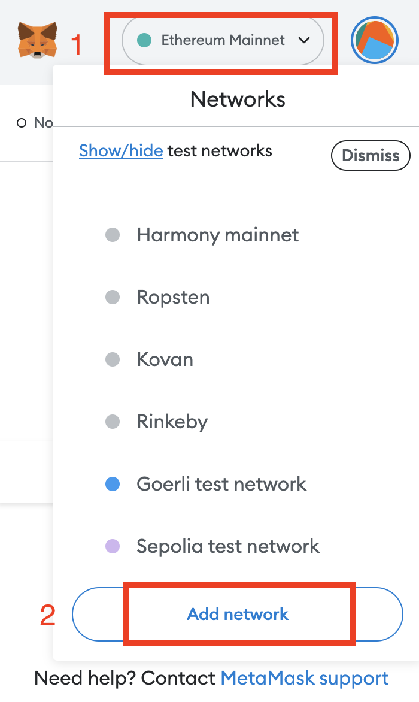
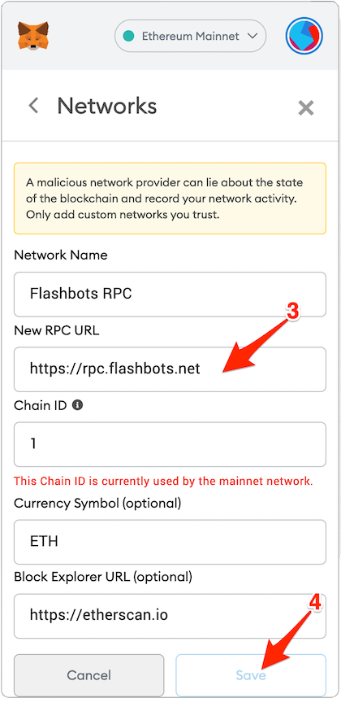

# WTF Ethers: 25. Flashbots

I recently revisited `ethers.js` to refresh my knowledge of the details and also to create a "# WTF Ethers Guide" for beginners to use.

Twitter: [@0xAA_Science](https://twitter.com/0xAA_Science) | [@WTFAcademy_](https://twitter.com/WTFAcademy_)

WTF Academy Community: [Discord](https://discord.gg/5akcruXrsk) | [WeChat Group](https://docs.google.com/forms/d/e/1FAIpQLSe4KGT8Sh6sJ7hedQRuIYirOoZK_85miz3dw7vA1-YjodgJ-A/viewform?usp=sf_link) | [Official Website wtf.academy](https://wtf.academy)

All code and tutorials are open-source on GitHub: [github.com/WTFAcademy/WTFEthers](https://github.com/WTFAcademy/WTFEthers)

---

> Currently, Flashbots Bundle only supports ethers.js v5.

After the transition of Ethereum to Proof of Stake (POS), over 60% of blocks are produced by Flashbots, which is quite impressive. However, many people are not familiar with it. In this lesson, we will introduce Flashbots, including:
1. What is Flashbots?
2. How can regular users connect to Flashbots nodes to send private transactions?
3. How can developers use Flashbots Bundle to bundle multiple transactions?

## Flashbots

Flashbots is a research organization committed to mitigating the harm caused by Maximum Extractable Value (MEV) on the blockchain. Currently, they have the following products:
1. Flashbots RPC: Protects Ethereum users from harmful MEV (sandwich attacks).
2. Flashbots Bundle: Helps MEV searchers extract MEV on Ethereum.
3. mev-boost: Helps Ethereum POS nodes earn more ETH rewards through MEV.

In this tutorial, we will mainly focus on the first two products.

## Flashbots RPC

Flashbots RPC is a free product for regular Ethereum users. By setting the RPC (network node) in your encrypted wallet to Flashbots RPC, you can send transactions to Flashbots' private transaction mempool instead of the public one, avoiding the harm caused by frontrunning transactions/sandwich attacks. If you are not familiar with the mempool or frontrunning transactions, you can read the previous tutorials on [mempool](https://github.com/WTFAcademy/WTFEthers/blob/main/19_Mempool/readme.md) and [frontrunning](https://github.com/WTFAcademy/WTFEthers/blob/main/23_Frontrun/readme.md).

Now, let's demonstrate how to connect to Flashbots RPC using the Metamask wallet.

1. Click the network button at the top of Metamask (which displays "Ethereum Mainnet" by default), then click the "Add network" button at the bottom to add a network node (the new version of Metamask requires clicking the "Add a network manually" button on the next page).



2. Enter the network parameters as follows:

```
Network name: Flashbots RPC
New RPC URL: https://rpc.flashbots.net
Chain ID: 1
Currency Symbol: ETH
Block Explorer URL: https://etherscan.io
```



After completing these two steps, your encrypted wallet will successfully connect to Flashbots RPC, and you can use it as usual to avoid sandwich attacks!

## Flashbots Bundle

Developers who search for MEV opportunities on the blockchain are called "searchers." Flashbots Bundle is a tool that helps searchers extract MEV from Ethereum transactions. Searchers can use it to combine multiple transactions and execute them in a specified order.

For example, if a searcher finds an opportunity for sandwich attacks in a transaction that buys PEOPLE tokens on the public mempool, they can insert a buy and sell transaction before and after this transaction, respectively, to form a transaction bundle and send it to Flashbots. These transactions will be executed in the specified block without changing the order, and there is no need to worry about being attacked by other MEV bots.


## Flashbots Bundle Script

Flashbots provides [ethers-provider-flashbots-bundle](https://github.com/flashbots/ethers-provider-flashbots-bundle), a JavaScript library built on top of `ethers.js` that helps searchers connect to the Flashbots provider and send Flashbots bundles. You can install it using the `npm` command.

```shell
npm install --save @flashbots/ethers-provider-bundle
```

Now, let's write a script using it to demonstrate how to send a Flashbots Bundle on the Goerli test network. The code is open-source in the [WTF-Ethers repo](https://github.com/WTFAcademy/WTF-Ethers).

1. Create a regular provider connected to a non-Flashbots RPC. Here, we use the Goerli test network node provided by Alchemy.
    ```js
    // 1. Regular RPC (non-Flashbots RPC)
    const ALCHEMY_GOERLI_URL = 'https://eth-goerli.alchemyapi.io/v2/GlaeWuylnNM3uuOo-SAwJxuwTdqHaY5l';
    const provider = new ethers.providers.JsonRpcProvider(ALCHEMY_GOERLI_URL);
    ```

2. Create a Flashbots `reputation private key` to establish "reputation" [details](https://docs.flashbots.net/flashbots-auction/searchers/advanced/reputation)
    > Note: This account should not store funds and is not the main Flashbots private key.
    ```js
    const authKey = '0x227dbb8586117d55284e26620bc76534dfbd2394be34cf4a09cb775d593b6f2c'
    const authSigner = new ethers.Wallet(authKey, provider)
    ```

3. Create a Flashbots RPC (test network) for sending transactions. This involves the regular provider and the reputation private key.
    ```js
    const flashbotsProvider = await FlashbotsBundleProvider.create(
        provider,
        authSigner,
        // Use Mainnet Flashbots, delete the following two lines
        'https://relay-goerli.flashbots.net/',
        'goerli'
        );
    ```

4. Create a transaction that conforms to the `EIP1559` standard with the content of sending 0.001 ETH test tokens to the WTF Academy address. This involves the wallet private key (with assets) and the regular provider.
    ```js
    const privateKey = '0x227dbb8586117d55284e26620bc76534dfbd2394be34cf4a09cb775d593b6f2c'
    const wallet = new ethers.Wallet(privateKey, provider)
    // EIP 1559 transaction
    const transaction0 = {
    chainId: CHAIN_ID,
    type: 2,
    to: "0x25df6DA2f4e5C178DdFF45038378C0b08E0Bce54",
    value: ethers.parseEther("0.001"),
    maxFeePerGas: GWEI * 100n
    }
    ```

5. Create a transaction bundle. Here, we only bundle one transaction, but in practice, you can bundle multiple signed or unsigned transactions.

    ```js
    const transactionBundle = [
```
{
    "signer": "wallet", 
    "transaction": "transaction0" 
},
{
    "signedTransaction": "SIGNED_ORACLE_UPDATE_FROM_PENDING_POOL"
}
```

Simulate the transaction and print transaction details. The bundle must be successfully simulated before it can be executed. Here we use the flashbots provider's `signBundle()` and `simulate()` methods. Note that the `simulate()` method needs to specify the target block height for transaction execution, which is set to the next block here.

```js
// Sign transactions
const signedTransactions = await flashbotsProvider.signBundle(transactionBundle)
// Set the target execution block for the transactions
const targetBlockNumber = (await provider.getBlockNumber()) + 1
// Simulate
const simulation = await flashbotsProvider.simulate(signedTransactions, targetBlockNumber)
// Check if simulation is successful
if ("error" in simulation) {
    console.log(`Simulation error: ${simulation.error.message}`);
} else {
    console.log(`Simulation successful`);
    console.log(JSON.stringify(simulation, null, 2))
}
```

Send the transaction bundle to the blockchain. Since Flashbots Bundle requires specifying the execution block height and there are only few Flashbots nodes on the testnet, it takes many attempts to successfully submit the bundle to the chain. Therefore, we use a loop to try executing the bundle within the next 100 blocks. We use the flashbots provider's `sendRawBundle()` method to send the bundle. There are three possible transaction results:
- `BundleIncluded`: The bundle is successfully included in a block.
- `BlockPassedWithoutInclusion`: The bundle is not included and needs further attempts.
- `AccountNonceTooHigh`: Incorrect Nonce value.

From the image below, we can see that the bundle we submitted was successfully included in a block after 5 attempts.

```js
for (let i = 1; i <= 100; i++) {
    let targetBlockNumberNew = targetBlockNumber + i - 1;
    // Send transactions
    const res = await flashbotsProvider.sendRawBundle(signedTransactions, targetBlockNumberNew);
    if ("error" in res) {
        throw new Error(res.error.message);
    }
    // Check if transaction is included in a block
    const bundleResolution = await res.wait();
    // Transaction can have three states: included in a block / not included / high Nonce.
    if (bundleResolution === FlashbotsBundleResolution.BundleIncluded) {
        console.log(`Congrats, transaction successfully included in block: ${targetBlockNumberNew}`);
        console.log(JSON.stringify(res, null, 2));
        process.exit(0);
    } else if (bundleResolution === FlashbotsBundleResolution.BlockPassedWithoutInclusion) {
        console.log(`Please retry, transaction not included in block: ${targetBlockNumberNew}`);
    } else if (bundleResolution === FlashbotsBundleResolution.AccountNonceTooHigh) {
        console.log("Nonce too high, please reset");
        process.exit(1);
    }
}
```

Summary

In this lecture, we introduced several Flashbots products and focused on the Flashbots RPC network node that protects regular users from malicious MEV and the Flashbots Bundle for developers. Finally, we wrote a script to send a Flashbots Bundle. We hope this tutorial has given you a better understanding of MEV and Flashbots. What will you do with them?